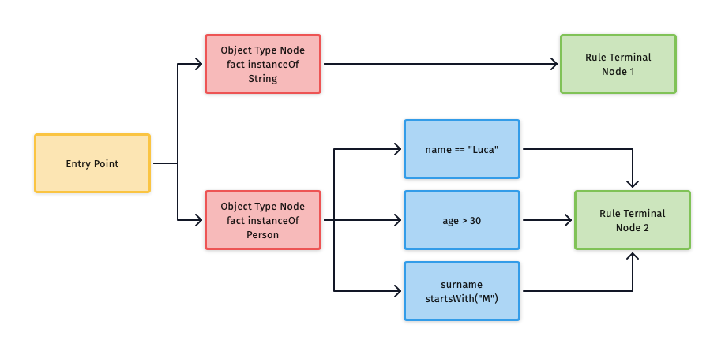
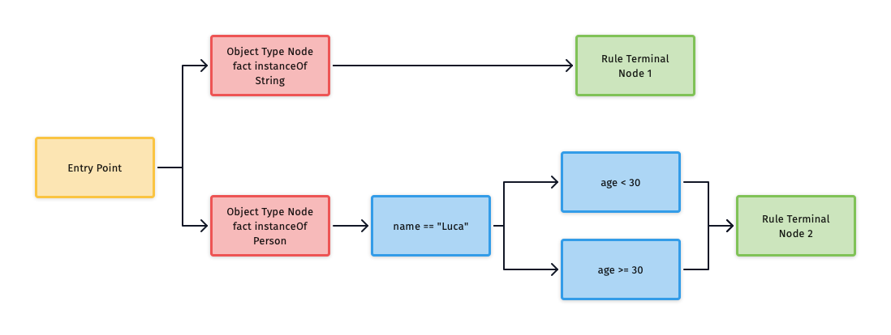
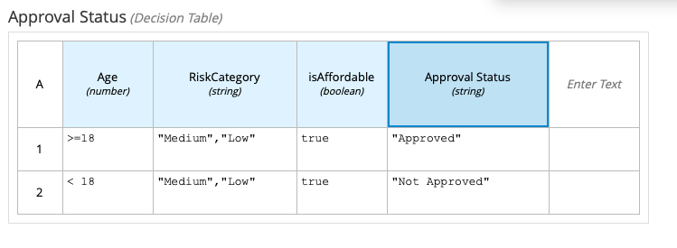
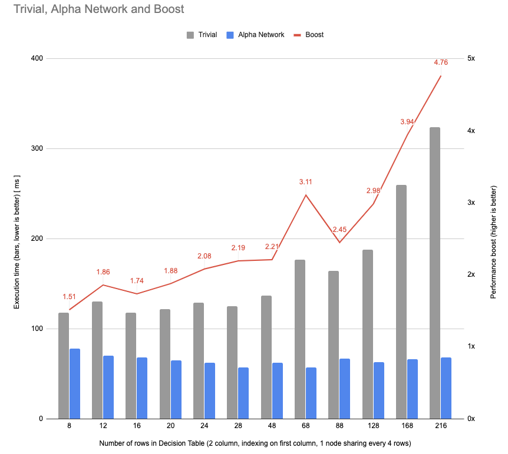

# Demystifying the Alpha Network Compiler (ANC)

### Luca Molteni


---

# Quick introduction to Rete nodes 

- **Object Type Nodes** 
- **Alpha Nodes**
- **Rule Terminal Nodes**
- BetaNode
- Other kinds

^ Let me give you a small introduction on how rules are evaluated in the Rete/PHREAK algorithm. 
You might know the rete is the main data structure underneath Drools, and it's basically a graph of nodes.
There are various kinds of nodes, for example Object Type Nodes (OTN), Alpha Nodes, Beta Nodes, etc...
As the Alpha Network Compiler is an optimization that is effective where there are multiple Alpha Nodes inside a rete, so for today 
we'll stick to a very simple rete comprised of Object Type Nodes, Alpha Nodes and Rule Terminal Node.
Each fact inserted in the working memory is tested against each node in order, starting from the Object Type Node.

--- 

# What is an Object Type Node?



^ Think of an Object Type Node as a Java  instanceof operation. If an object matches the type defined in the OTN it will enter the Rete
from that node. There's one OTN for each Java Type defined in each pattern. If two rules has two different patterns on the same object type 
then only one OTN will be created. 
https://github.com/kiegroup/drools/blob/master/drools-core/src/main/java/org/drools/core/reteoo/ObjectTypeNode.java

---

# What is an Alpha Node?

`age > 30`
`name == "Luca"`
`surname startsWith("M")`

^ Alpha Nodes represent a constraint inside the network. Examples might be

---

# What is an Alpha Node?
 


---

# What is an Alpha Node? 

When a Pattern has two different constraints, then one node for each constraint will be created. 

`Person(name == "Luca, surname startsWith("M"))`

Will generate two different Alpha Nodes.

^ https://github.com/kiegroup/drools/blob/master/drools-core/src/main/java/org/drools/core/reteoo/AlphaNode.java

---

# Rule Terminal Node


^ A Rule Terminal Node represent the end of an evaluation. 
In this article we deal only with Alpha Terminal Nodes, which represents the end of the evaluation of an Alpha Network.
During a typical Drools evaluation the terminal nodes interact with the agenda, which is the data type we use to synchronize the 
consequences of the rules, but in this article we ignore that part. 

---

# Alpha Node Sharing

```
rule "Luca minus 30"
when
    Person(name == "Luca", age < 30)
then
end

rule "Luca greater than 30"
when
    Person(name == "Luca", age >= 30)
then
end
```

^ Let us see the first optimization of the PHREAK network: Alpha Node Sharing.
If we have different patterns for example in different rules
As we said before, each constraint inside a pattern will generate a single alpha node, and given that the 
first part of the pattern is identical in both cases, only three Alpha Nodes will be created, the first will be 
the one representing the constraint `Person(name == "Luca)` and as children this Alpha Node will have two others Alpha node, 
one for the `age < 30` and the other for `age >= 30`.

---

# Alpha Node Sharing diagram



---

# How are Alpha Nodes evaluated? 

```java

    interface DroolsNode {
        void assertObject(Object s);
    }

```
^ How are nodes evaluated internally?
Let's see a simplistic example to understand how this works. A Node is a Java type having a single method

---

# How are Alpha Nodes evaluated?

```java
    class DroolsAlphaNode implements DroolsNode {
    
        public DroolsAlphaNode(Predicate<Object> predicate, 
                               DroolsNode nextNode) {
            this.predicate = predicate;
            this.nextNode = nextNode;
        }

        @Override
        public void assertObject(Object s) {
            if(predicate.test(s)) {
                nextNode.assertObject(s);
            }
        }
    }
```

^ Each node implements this interface, in our case, we'll have a
In the Drools codebase:
https://github.com/kiegroup/drools/blob/master/drools-core/src/main/java/org/drools/core/reteoo/AlphaNode.java#L134
After being evaluated in the Object Type Node of type String, the OTN will call assertObject on the first child, which will evaluate
the constraint (in this case a simple Java predicate) and will propagate the assertion to the next node. 
When the last node is an AlphaRuleTerminalNode, the evaluation will end.

---

# How are Alpha Nodes evaluated?

```java
class TerminalNode implements DroolsNode {

    public void assertObject(String s) {
        // do something
    }
}

```

---

# How are Alpha Nodes evaluated?

```java

    for (DroolsNode p : constraints) {
        p.assertObject(s);
    }

```

^ When there are multiple non related Alpha Nodes, each Alpha Node will be checked against the input object such as
See https://github.com/kiegroup/drools/blob/master/drools-core/src/main/java/org/drools/core/reteoo/CompositeObjectSinkAdapter.java#L619
This is not efficient as we need to check an if with dynamic dispatch against every single one of the Alpha Nodes.
This approach is simple enough and works well, problem is terribly inefficient. A Java Predicate can express
every possible boolean condition, but it's not the fastest way to evaluate what in the Java world could be a simple if.
Using a Java predicate will mean using dynamic dispatch as the JVM doesn't know the implementation of the `DroolsNode` interface and that is notoriously slow .

---

# Hashing 

_When we assemble the rete_

```java
        hashedSinkMap.put("10", terminalNode10);
        hashedSinkMap.put("20", terminalNode20);
        hashedSinkMap.put("30", terminalNode30);
        
```

_When we evaluate_

```java
         DroolsNode p = (DroolsNode) hashedSinkMap.get(s);
            if(p != null) {
                p.assertObject(s);
          }
            
```

^ Hashing is one of the first optimization that is implemented in the current code base.
When a field is hashable, for example when dealing with String and Integers, after a certain amount of Alpha Nodes it will keep an internal map of the Alpha Nodes using the actual value as the key.
Something among the line of
This improves the evaluation of a fact against multiple Alpha Nodes, as a simple .get in the map will bring us the correct Alpha Node to propagate the object to
Something among this line
What I wanted to show you is just one of the optimisation that is in the code bases. There are many more, let's see the compiled the Alpha Network

---

#  Compiled Alpha Network

* Generate class that leverages the code generation for faster evaluation
* Supports alpha node sharing
* Supports hashing/inlining
* Supports range indexing

^ The Alpha Network Compiler leverages the code generation to have a faster evaluation of the constraints. Let's see some of its cases

---

# Worst case scenario

```
    rule
    when $s : String( length > 4, length < 10)
    then end

```

```java
    public final void propagateAssertObject(...) {
        if (lambdaConstraint4.isAllowed(handle, wm)) {
            if (lambdaConstraint5.isAllowed(handle, wm)) {
                alphaTerminalNode6.assertObject(handle, context, wm);
            }
        }
    }
```

^ When none of the constraints are indexable, the ANC will generate nested ifs, for example this Rule
Will generate this assertObject method
As you can see there are no alpha nodes in this propagateAssertObject method. The constraints are unwrapped from the alpha node and set as a field of the class.
This is the worst case scenario as each constraint will become an if, multiple constraint will mean multiple ifs. 
At least the order of the ifs will be determined by the Alpha Node Sharing optimization we saw before, so it's faster than evaluating the ifs in a random order.

---

# Inlining 


```
    rule r1
    when  $s : Person( name == \"Luca\")
    then end
    
    rule r2
    when  $s : Person( name == \"Mario\")
    then end
    
    rule r3
    when  $s : Person( name == \"Toshiya\")
    then end

```

^ A more interesting fact happens when we have multiple hashable constraints as we saw before, let's take as an example this rule

---

# Inlining

```java
    switch (switchVar) {
        case "Luca":
            alphaTerminalNode5.assertObject(handle, context, wm);
            break;
        case "Mario":
            alphaTerminalNode8.assertObject(handle, context, wm);
            break;
        case "Toshiya":
            alphaTerminalNode11.assertObject(handle, context, wm);
            break;
    }

```

^ Will generate this method instead
By inlining the strings as keyword inside a switch case we get even faster results.
We have provided a benchmark that demonstrates that this approach is faster than the worst-case brute force.

---

# Inlining Benchmark

```
Benchmark                      (N)  Mode  Cnt  Score   Error  Units
ANCBenchmark.testBruteForce  10000  avgt   12  0.203 ± 0.007  ms/op
ANCBenchmark.testHashing     10000  avgt   12  0.118 ± 0.001  ms/op
ANCBenchmark.testInlining    10000  avgt   12  0.083 ± 0.012  ms/op

```

---

# Range Indexing

* Enabled when there are many (more than 9) Alpha Nodes with > or <=
* Faster evaluation
* Supported in the ANC

^ https://github.com/kiegroup/drools/blob/master/drools-core/src/main/java/org/drools/core/reteoo/CompositeObjectSinkAdapter.java#L450-L449
Range indexing is yet another kind of optimization useful when we compare using the greater than and lesser than operators (different from inequality).
It uses a map that uses as key the kind of operator (i.e. > or <=) the value (such as 1, 2.0, BigDecimal.valueOf(4)) and the sign of comparison (ascending vs descending).
This leads to a general performance improvements when a precedent node contains more than nine alpha nodes with inequality constraints, but depending on the case
it could lead to faster results.
Range Indexing is supported also in the compiled alpha network

---

# Range Indexing ANC

```java

    private AlphaRangeIndex rangeIndex4_0; // including [AlphaNode(4) constraint=age > 10] etc.

        Collection<AlphaNode> rangeIndex4_0_result = 
            rangeIndex4_0.getMatchingAlphaNodes(handle.getObject());

    for (AlphaNode rangeIndex4_0_result_node : rangeIndex4_0_result) {
        switch(rangeIndex4_0_result_node.getId()) {
            case 4:
                Collection<AlphaNode> rangeIndex5_0_result = 
                    rangeIndex5_0.getMatchingAlphaNodes(handle.getObject());
                
                for (AlphaNode rangeIndex5_0_result_node : rangeIndex5_0_result) {
                    
                    switch(rangeIndex5_0_result_node.getId()) {
                        case 5:
                            alphaTerminalNode6.assertObject(handle, ((PropagationContext) wm, null);
                            break;
                    }
                }
                break;
        }
    }

```

---

# Current state in DMN Alpha Network



---


# Current state in DMN Alpha Network

* Working POC with handcrafted Alpha Network
* FEEL expressions in cells are translated into Java
* Java sources generate the rete and instantiate the evaluation

^ We've created an implementation of Decision Table evaluation using this approach. We parse a DMN Decision Table and for each cell we generate an Alpha Node with a constraint.
Then, after a round of node sharing, we give the Alpha Nodes as inputs of the ANC (Alpha Network Compiler) and we generate the class using DTable output as Rule Terminal Node.
We created a benchmark out of this and discovered that this approach is faster than evaluating a DTable with a brute force approach.

---

# Working POC Benchmark




---

# FEEL Expression

```java
public class UnaryTestR1C1 implements CompiledFEELUnaryTests {

    /**
     *   FEEL: >=18
     */
    public List<UnaryTest> getUnaryTests() {
        return (List) (CompiledFEELSemanticMappings.list(UT____62_6118));
    }

    private static UnaryTestR1C1 INSTANCE;
    
    public static final BigDecimal K___18 = new BigDecimal(18, MathContext.DECIMAL128);

    public static final UnaryTest UT____62_6118 = 
            (feelExprCtx, left) -> CompiledFEELSemanticMappings
                    .includes(feelExprCtx,
                             range(feelExprCtx, CLOSED, K___18, null, RangeBoundary.OPEN), 
                             left);
}
```

---

# Hand crafted Alpha Network

```java
    public AlphaNodeCreation0(NetworkBuilderContext ctx) {
        alphaNetworkCreation = new AlphaNetworkCreation(ctx);
        Index indexR1C1 = alphaNetworkCreation
                .createIndex(java.math.BigDecimal.class, x -> (java.math.BigDecimal) x.getValue(0), null);
        
        AlphaNode alphaNodeR1C1 = alphaNetworkCreation
                .createAlphaNode(ctx.otn, "Age_62_6118", this::testR1C1, indexR1C1);
        
        AlphaNode alphaNodeR1C2 = alphaNetworkCreation
                .createAlphaNode(alphaNodeR1C1, "RiskCategory_34Medium_34_44_34Low_34", this::testR1C2);
        
        AlphaNode alphaNodeR1C3 = alphaNetworkCreation
                .createAlphaNode(alphaNodeR1C2, "isAffordabletrue", this::testR1C3);
        
        alphaNetworkCreation.addResultSink(alphaNodeR1C3, "Approved");
    }

    boolean testR1C1(TableContext x) {
        return UnaryTestR1C1.getInstance().getUnaryTests().stream().anyMatch(t -> {
            Boolean result = t.apply(x.getEvalCtx(), x.getValue(0));
            return result != null && result;
        });
    }
```
---

# Assembling the evaluation

```java
public class DMNAlphaNetwork_an_45simpletable_45multipletests implements DMNCompiledAlphaNetwork {

    @Override
    public void initRete() {
        {
            new org.kie.dmn.core.alphasupport.AlphaNodeCreation0(ctx);
            new org.kie.dmn.core.alphasupport.AlphaNodeCreation1(ctx);
        }
        Index index3 = createIndex(String.class, x -> (String) x.getValue(0), "dummy");
        AlphaNode alphaDummy = alphaNetworkCreation.createAlphaNode(ctx.otn, x -> false, index3);
        alphaNetworkCreation.addResultSink(alphaDummy, "DUMMY");
    }

    @Override
    public Object evaluate(EvaluationContext evalCtx) {
        resultCollector.clearResults();
        TableContext ctx = new TableContext(evalCtx, new java.lang.String[] { "Age", "RiskCategory", "isAffordable" });
        compiledNetwork.propagateAssertObject(new DefaultFactHandle(ctx), null, null);
        return resultCollector.getWithHitPolicy();
    }
```

---

# Generated ANC - Setup

```java
public class CompiledAlphaNetwork extends org.drools.ancompiler.CompiledNetwork {

    InternalReadAccessor readAccessor;
    
    // [AlphaNode(4) constraint=Constraint for 'Age_62_6118' (index: AlphaIndex #1 (EQUAL, left: lambda 1732945446, right: null))]
    private LambdaConstraint lambdaConstraint4;

    // [AlphaNode(5) constraint=Constraint for 'RiskCategory_34Medium_34_44_34Low_34' (index: null)]
    private LambdaConstraint lambdaConstraint5; 

    public CompiledAlphaNetwork(InternalReadAccessor readAccessor, Map<String, AlphaRangeIndex> rangeIndexDeclarationMap) {
        this.readAccessor = readAccessor;
    }

    protected void setNetworkNodeReference(NetworkNode node) {
        boolean setNetworkResult0 = false;
        switch (node.getId()) {
            case 4:
                lambdaConstraint4 = (LambdaConstraint) ((AlphaNode) node).getConstraint();
                setNetworkResult0 = true;
                break;
    }
}

```
---

# Generate ANC - propagateAssertObject

```java
public class CompiledAlphaNetwork extends org.drools.ancompiler.CompiledNetwork {
    public final void propagateAssertObject(InternalFactHandle handle, 
                                            PropagationContext context, 
                                            InternalWorkingMemory wm) {
        if (lambdaConstraint4.isAllowed(handle, wm)) {
            if (lambdaConstraint5.isAllowed(handle, wm)) {
                if (lambdaConstraint6.isAllowed(handle, wm)) {
                    resultCollectorAlphaSink7.assertObject(handle, context, wm);
                }
            }
            if (lambdaConstraint8.isAllowed(handle, wm)) {
                if (lambdaConstraint9.isAllowed(handle, wm)) {
                    resultCollectorAlphaSink10.assertObject(handle, context, wm);
                }
            }
        }
        if (lambdaConstraint11.isAllowed(handle, wm)) {
            resultCollectorAlphaSink12.assertObject(handle, context, wm);
        }
    }
}
```
---
# A few considerations

## Generate the "leanest" Compiled Alpha Network possible

* Current API needs instantiated RETE
* Fewer Java sources possible
* A very small representation of an Alpha Network
* Only doable when there are only alpha nodes

^ Not only the compiled alpha network is an evaluation optimisation, with alpha node sharing, inlining and range indexing, 
it can become also a "lean" representation of an Alpha Network without using the full rete generate by the executable model.
If we already know that our rete will consists only of Alpha Nodes and we don't need the synchronization of the Agenda, we can generate the compiled Alpha Network giving as it's input the Alpha Nodes and the 
Rule Terminal Node, therefore having a class that rapresent only the important part of the evaluation
The work of the DMN Alpha Network is still a work in progress. We still to need to support all the possible hit policies and moreover move most of the generation
at compile time, so that when instantiating the compiled Alpha Network we don't need the full rete. Currently this is not doable, and what we have is
We might need the consequence of the rule terminal node using the externalisation of the lambdas, so that in the end we can have only the compiled alpha network and the outputs.

---

# Further improvements?

## Discuss
